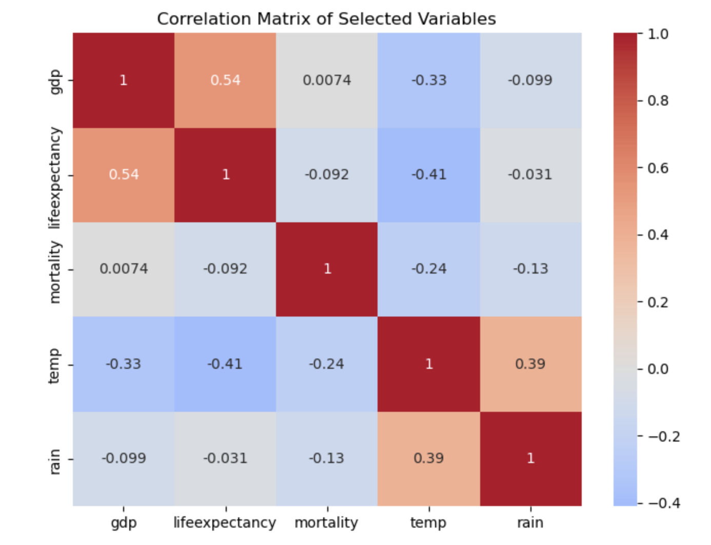

# ECD Dataset Exploration and Analysis

Welcome to the ECD (EcoCultural Dataset) analysis project! This repository contains a comprehensive exploration and analysis of the ECD dataset, which includes country-level ecological and cultural data from 220 countries. The dataset covers various ecological and cultural variables to facilitate an investigation into the relationships between ecological factors and cultural variation.

## Overview
The primary objective of this project is to explore the ECD dataset, understanding patterns, correlations, and trends in ecological and cultural variables across countries. This project leverages data exploration techniques and visualizations to gain insights into global ecological and cultural dynamics over time.

### Key Components
- **Data Exploration**: Basic exploration of the dataset, including an overview of structure, summary statistics, and handling missing data.
- **Descriptive Analysis**: Calculation of summary statistics and inspection of distributions to understand data characteristics.
- **Correlation Analysis**: Visualization of correlations between selected ecological and cultural variables.
- **Time-Series Analysis**: Examination of temporal trends in selected ecological variables for individual countries.
- **Geographical Analysis**: Visualization of variables on a geographical map to reveal regional patterns.

## Jupyter Notebook

The main code for this analysis is stored in the Jupyter Notebook file **`ECD_Analysis.ipynb`**. This notebook enables an interactive experience, allowing users to replicate and modify the steps of the analysis.

### Running the Notebook
1. Open the **ECD_Analysis.ipynb** file in your Jupyter environment or Google Colab.
2. Ensure that all required libraries (`pandas`, `numpy`, `matplotlib`, and `seaborn`) are installed.
3. Execute each cell to perform data loading, cleaning, visualization, and analysis.

## Visualization Example

Below is an example heatmap from the notebook illustrating the correlation matrix of selected ecological and cultural variables.

## Dataset
The ECD dataset provides detailed ecological and cultural data on a country level, facilitating exploration of global patterns and trends. It includes information on various ecological variables such as rainfall, temperature, GDP, and life expectancy, alongside cultural variables like individualism and subjective well-being.

| **Variable**              | **Description**                                                       |
|---------------------------|-----------------------------------------------------------------------|
| Country                   | Name of the country                                                  |
| Year                      | Year of data entry                                                   |
| Rainfall (mm)             | Average annual rainfall                                              |
| Temperature (°C)          | Average annual temperature                                           |
| GDP per Capita (USD)      | Gross Domestic Product per capita                                    |
| Income Inequality (Gini)  | Income inequality measured by the Gini index                         |
| Population Density        | Population density per square kilometer                              |
| Individualism             | Cultural value measuring individualism                               |
| Subjective Wellbeing      | Subjective well-being index                                          |

For more detailed information, please refer to the dataset documentation provided with the ECD data.
